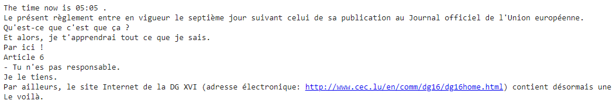
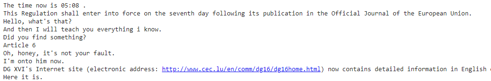
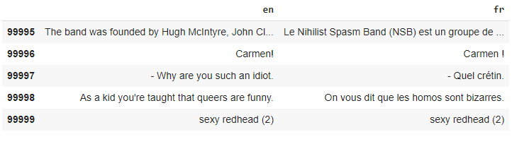
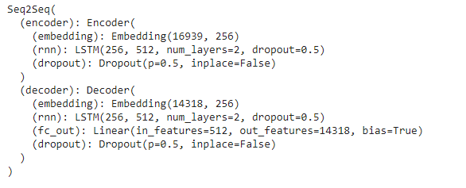
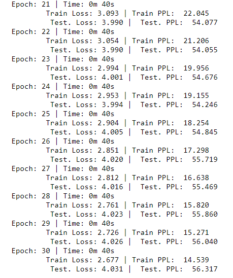
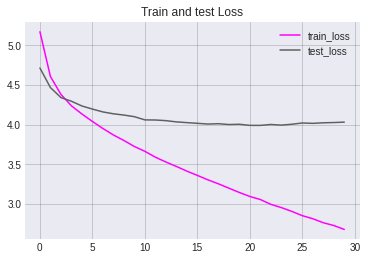
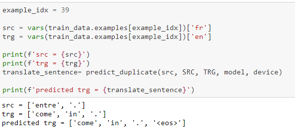
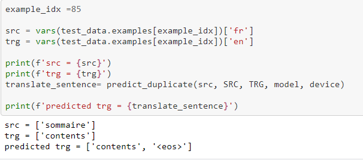

# French to English translation with dataset from OPUS-100 corpus

## Introduction

Here we will be building a sequence to sequence deep learning model for French to English translation. Sequence to Sequence (seq2seq) model here uses an encoder-decoder architecture. Encoder neural network encodes the input sequence(French sentence) into a single vector, also called as a Context Vector,which is an abstract representation of the input sequence. This vector is then passed into the decoder neural network, which is used to output the corresponding output sequence (English translation), one word at a time.

## Dataset

Dataset we use is from OPUS-100 corpus. It is an English-centric multilingual corpus covering 100 languages. OPUS is a growing collection of translated texts from the web.

The entire corpus can be downloaded from opus-100-corpus-v1.0.tar.gz. Individual language pairs are also available from http://data.statmt.org/opus-100-corpus/v1.0 or from the OPUS object storage, e.g. https://object.pouta.csc.fi/OPUS-100/v1.0/opus-100-corpus-de-en-v1.0.tar.gz 

OPUS-100 is English-centric, meaning that all training pairs include English on either the source or target side. The OPUS collection is comprised of multiple corpora, ranging from movie subtitles to GNOME documentation to the Bible.

We will use French-English sentence pairs for our French-English neural translation model. The dataset is split into training, development, and test portions. It has been randomly sampled up to 1M sentence pairs per language pair for training and up to 2000 each for development and test. To ensure that there was no overlap (at the monolingual sentence level) between the training and development/test data, filter was applied by creators during sampling to exclude sentences that had already been sampled.

Our source data (French) file is as shown below:

And target ,English file is as follows,

We merge both files and create our final dataset in tabular as follows.

Due to memory constraints  , we will be taking only short sentences ( less than length 10 maximum length ) from  file for modeling. We have 1M total sentence pairs ,which we randomly split further into train and test set in 70 : 30 ratio. 

After all preprocessing , we have 33049 train French -English sentence pairs and 14164 test sentence pairs.

### Model

Sequence to Sequence (seq2seq) model here uses an encoder-decoder architecture. Encoder neural network encodes the input sequence(question) into a single vector, also called as a Context Vector,which is an abstract representation of the input sequence. This vector is then passed into the decoder neural network, which is used to output the corresponding output sequence (answer), one word at a time. Model  and parameters are as follows :

Parameters:

- Encoder Embedding_dim = 256

- Decoder Embedding_dim = 256

- Hidden_nodes = 512

- Output_nodes = 5

- Number of layers = 2

- Encoder Dropout = 0.2

- Decoder Dropout= 0.2

  

Optimizer:  `Adam` adapts the learning rate for each parameter, giving parameters that are updated more frequently lower learning rates and parameters that are updated infrequently higher learning rates.

Loss function : `CrossEntropyLoss`

Learning rate : 1e-4

Epochs :10

### Results

###### Train and test logs

###### Train and test loss 

|       | Loss | Perplexity |
| ----- | ---- | ---------- |
| Train | 2.67 | 14.53      |
| Test  | 4.03 | 56.3       |

###### Predictions

